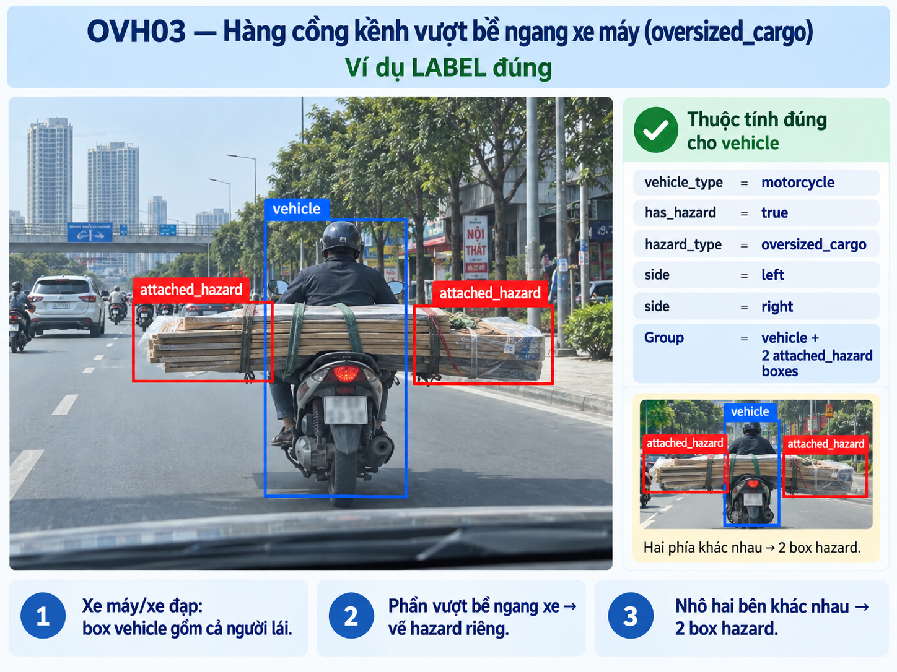
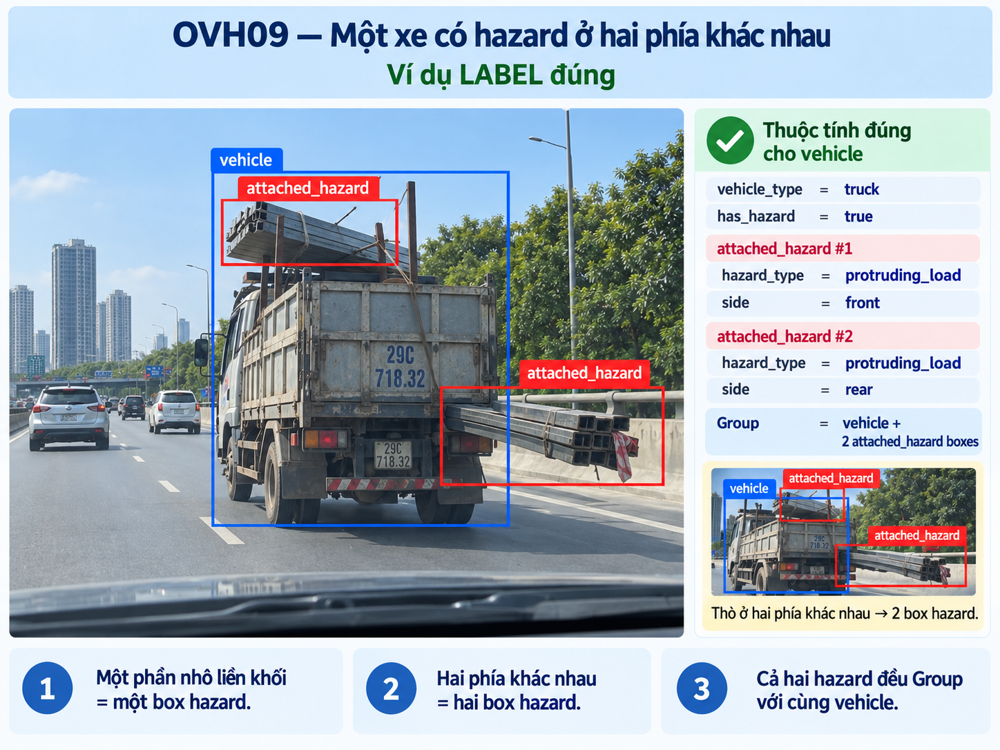
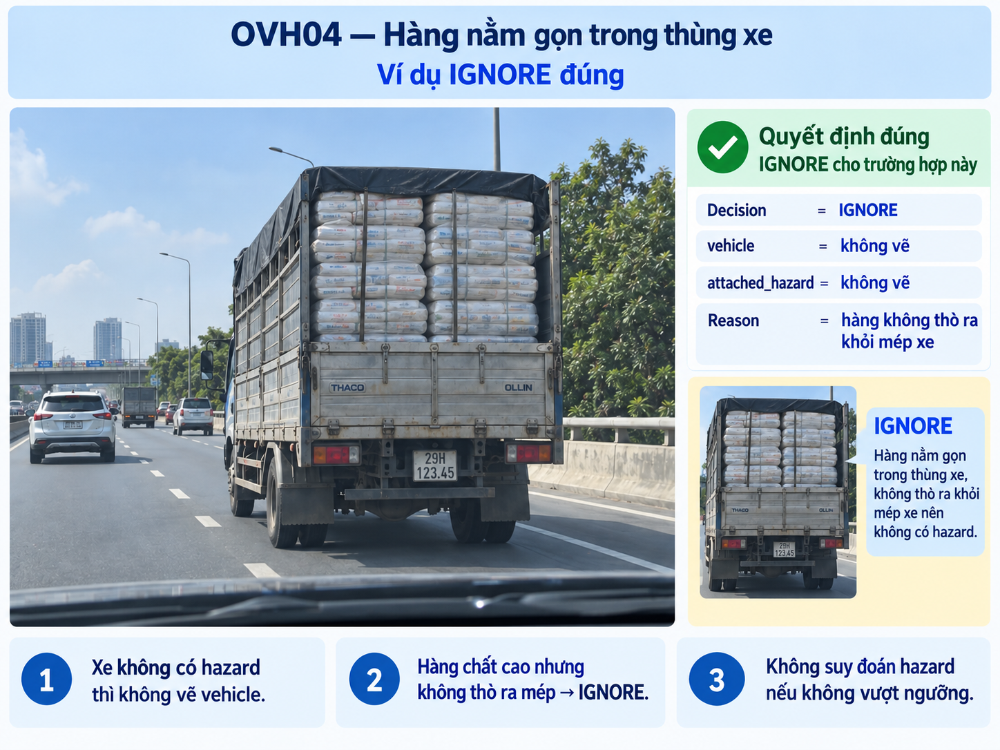
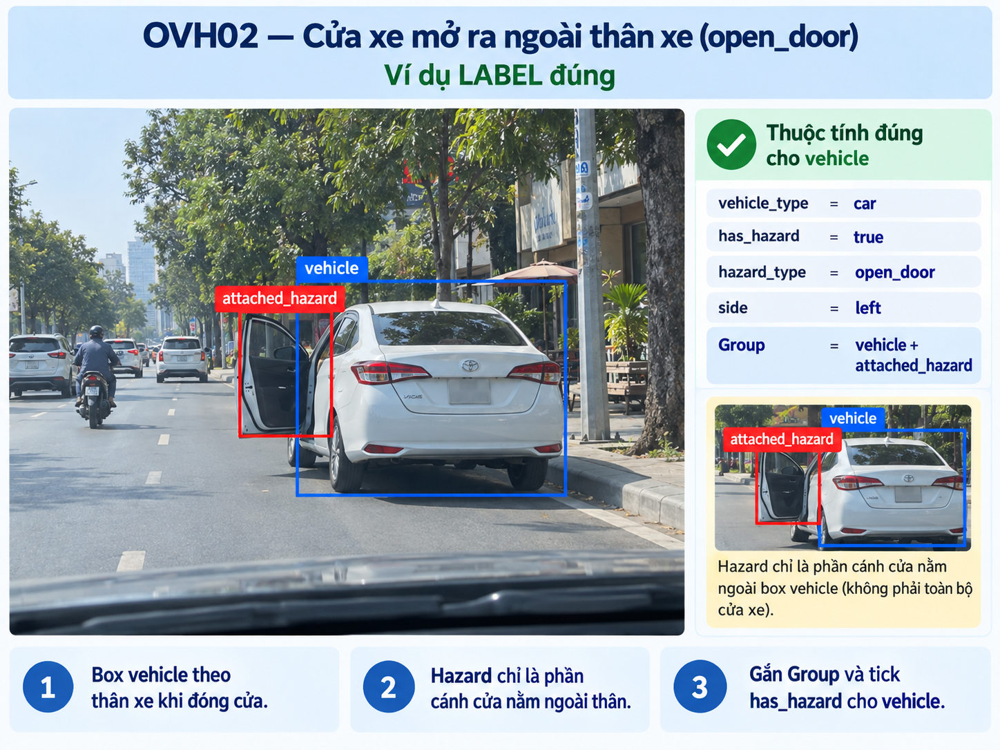
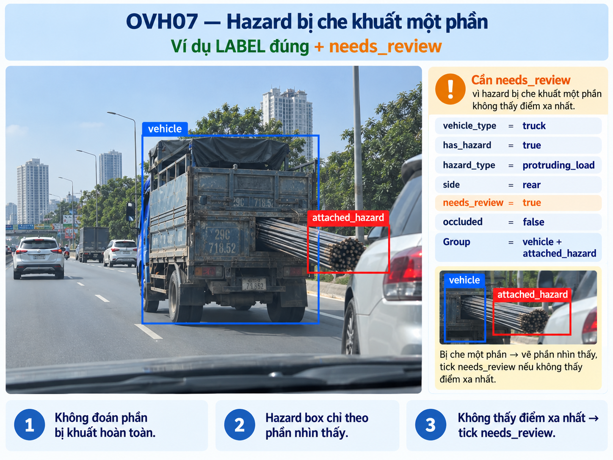
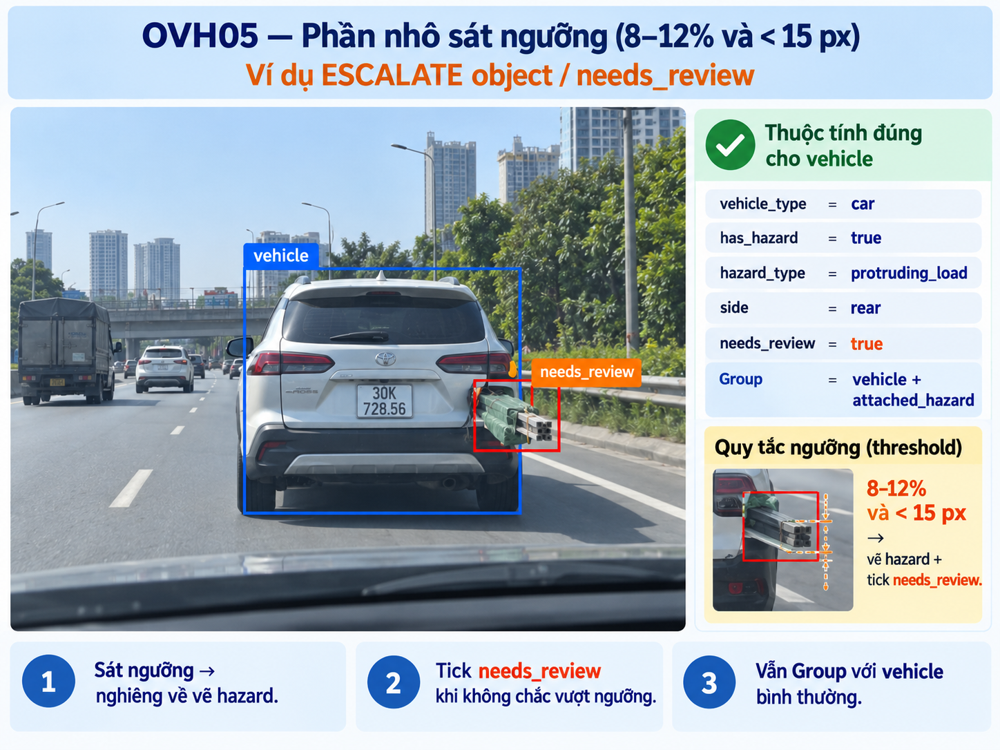
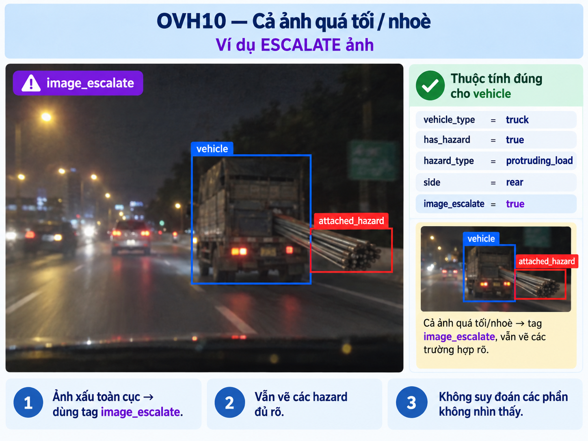

# Annotation guideline — Rear cargo overhang

**Version:** v1

## 1. Objective + scope

Phát hiện hàng hóa cồng kềnh hoặc vật liệu dài nhô rõ phía sau phương tiện trong ảnh dashcam. Tách phần hàng nhô khỏi thân xe để giữ box xe phục vụ ước lượng khoảng cách và biểu diễn vùng va chạm phía sau xe.

[../data/Team-generate/ChatGPT Image Sep 26, 2026, 11_31_19 AM.png]

Chỉ label hàng hóa/vật liệu được gắn, buộc hoặc chở trên ô tô, xe tải hoặc xe máy và nhô phía sau thân xe, ước lượng trên 20 cm. Với ảnh tĩnh, dùng ngưỡng nhìn thấy thay thế: phần nhô dài ít nhất 15 px **hoặc** ít nhất 12% chiều dài visible box của xe theo trục trước--sau. Chỉ label khi nhìn rõ xe gốc, phần hàng nhô và quan hệ giữa chúng.

Ngoài scope: cửa/cốp/bửng mở, vật nhô sang hai bên hoặc phía trước, ô/dù, gương/cản/bánh xe bình thường, hàng nằm hoàn toàn trong xe, người đi bộ, vật thể trên đường, vật thể nền, bóng và phản chiếu.

## 2. Annotation unit

Task là ảnh tĩnh. Mỗi ảnh được xử lý độc lập; không tracking và không dùng thông tin từ ảnh/frame khác.

Chỉ tạo annotation cho phương tiện có hàng nhô phía sau: một `Vehicle` cho thân xe gốc và một `Attached_Hazard` cho khối hàng nhô. Cụm kiện hàng liên tục hoặc chồng liền nhau được gộp thành một `Attached_Hazard`. Các khối tách biệt rõ ràng được tạo box riêng và dùng cùng `Parent_ID`.

## 3. Geometry rule

Sử dụng visible rectangle/bounding box.

### `Vehicle`

- Ôm sát thân xe gốc nhìn thấy, gồm cabin/thùng xe tiêu chuẩn.
- Không bao gồm hàng hóa nhô phía sau, nền thừa hoặc phần bị che hoàn toàn.
- Bỏ qua các chi tiết tiêu chuẩn như gương, cản và bánh xe; các chi tiết này không làm mở rộng box xe.

### `Attached_Hazard`

- Ôm sát phần hàng nhô nhìn thấy phía sau xe.
- Nếu một phần hàng nằm trong thân xe, chỉ box phần vượt ra ngoài boundary thông thường của xe.
- Không bao gồm thân xe hoặc nền. Nếu bị cắt mép ảnh, box dừng tại mép ảnh.

Sai lệch tối đa 2 px mỗi cạnh ở ảnh gốc được chấp nhận. Không gộp `Vehicle` và `Attached_Hazard` thành một box lớn.

## 4. Taxonomy

### `Vehicle`

Rectangle cho thân xe gốc. Chỉ tạo khi xe có ít nhất một `Attached_Hazard` hợp lệ.

### `Attached_Hazard`

Rectangle cho hàng hóa/vật liệu nhô phía sau. Không có subtype hoặc direction vì scope đã cố định là rear cargo overhang.

### `Parent_ID`

`Attached_Hazard` bắt buộc có attribute `Parent_ID`: ID của `Vehicle` mà hàng gắn hoặc được chở trên đó. Trong CVAT, nhóm `Vehicle` và các `Attached_Hazard` cùng xe bằng **Group shapes** để kiểm tra trực quan liên kết; mọi hazard trong một group phải có cùng `Parent_ID` của xe cha.

Không có `Attached_Hazard` không liên kết: nếu không xác định được xe cha, `IGNORE` candidate đó và không tạo box hazard.

Không sử dụng `UNKNOWN`, `certainty`, `hazard_type`, `review_region` hoặc attribute ngoài contract này.

## 5. Inclusion / exclusion

### LABEL

Tạo `Vehicle` và `Attached_Hazard` khi đồng thời có xe gốc xác định được, hàng/vật liệu nhô rõ phía sau trên 20 cm, đạt ngưỡng nhìn thấy ở mục 1, và bằng chứng trực quan đủ cho thấy hàng thuộc xe đó. Nhóm các shape cùng xe trong CVAT và gán `Parent_ID` trước khi hoàn tất.

### IGNORE

Không tạo annotation cho xe không có hàng nhô phía sau; hàng nhô dưới 15 px **và** dưới 12% chiều dài visible box xe; hàng nhô ngang/nhô trước; cửa/cốp/bửng mở; vật chỉ nằm gần xe; vật thể nền; hoặc candidate quá nhỏ, quá mờ hay bị che đến mức không thể xác định quan hệ với xe.

Khi bằng chứng không đủ, không suy đoán và không tạo box `Vehicle` hay `Attached_Hazard`.

## 6. Visibility / occlusion

- Bị che một phần: chỉ label nếu vẫn nhận biết rõ hàng gắn phía sau xe; box chỉ theo phần nhìn thấy.
- Bị cắt mép ảnh: label nếu phần nhìn thấy đủ xác định object và quan hệ với xe; box dừng ở mép ảnh.
- Quá nhỏ, mờ, ngược sáng hoặc không phân biệt được boundary: `IGNORE`.
- Chỉ xuất hiện qua gương/kính hoặc phản chiếu: `IGNORE`.

## 7. Ambiguity / escalation

### LABEL

Tạo `Vehicle` và `Attached_Hazard`, nhóm các shape cùng xe trong CVAT, rồi gán `Parent_ID` trên `Attached_Hazard`.

### IGNORE

Không tạo box khi candidate ngoài scope hoặc bằng chứng không đủ. Đây là tie-breaker mặc định cho ảnh tĩnh, gồm cả trường hợp không xác định được xe cha. Task không có quyết định `UNKNOWN`.

### ESCALATE

Chỉ dùng khi QA/Project Lead chủ động chọn một case để thảo luận, không dùng để thay thế quyết định annotation thường ngày. Dùng **Open an issue** trong CVAT, khoanh vùng candidate và ghi:

`[Image <sample_id> - Object <id>] Không rõ hàng có gắn với xe hay không vì <lý do>. Đã tạm IGNORE theo guideline.`

Annotator không tạo nhãn suy đoán trong lúc chờ QA.

## 8. Temporal rule

Không áp dụng — task ảnh tĩnh. Không dùng frame trước/sau và không sử dụng track.

## 9. Examples

| Trường hợp | Expected output |
|---|---|
| Xe bình thường, không có hàng nhô phía sau | Không tạo annotation |
| Xe tải chở bó thép nhô rõ phía sau | `Vehicle` + `Attached_Hazard` + `Parent_ID` |
| Nhiều kiện hàng chồng liền thành một khối phía sau | Một `Attached_Hazard` gộp + `Parent_ID` |
| Hai khối hàng tách biệt rõ trên cùng xe | Hai `Attached_Hazard` riêng, cùng `Parent_ID` |
| Hàng nhô ngang xe máy | Không tạo annotation |
| Ô tô mở cửa hoặc cốp | Không tạo annotation |
| Vật dài nằm sau xe nhưng không thấy quan hệ gắn | Không tạo annotation; QA có thể mở Issue để thảo luận |
| Hàng bị che một phần nhưng vẫn xác định rõ là hàng của xe | Label phần nhìn thấy |
| Candidate quá nhỏ hoặc chỉ là phản chiếu | Không tạo annotation |

## 10. Common mistakes

1. Gộp thân xe và hàng nhô vào một `Vehicle` box.
2. Bỏ sót `Attached_Hazard` khi hàng nhô rõ phía sau.
3. Quên Group shapes, quên gán `Parent_ID`, hoặc gán nhầm hazard sang xe khác.
4. Box cả nền hoặc không khí thay vì chỉ phần hàng nhìn thấy.
5. Label cửa mở, hàng nhô ngang hoặc vật thể chỉ nằm gần xe.
6. Suy đoán phần bị che hoặc phần nằm ngoài mép ảnh.
7. Dùng thông tin từ frame/ảnh khác.
8. Tạo `Attached_Hazard` khi không chứng minh được quan hệ với xe.
